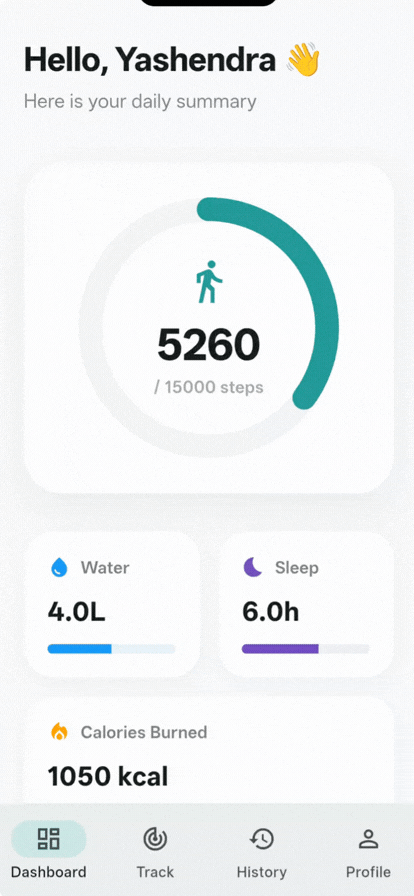
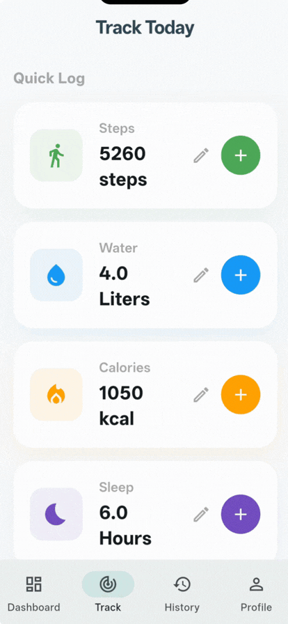
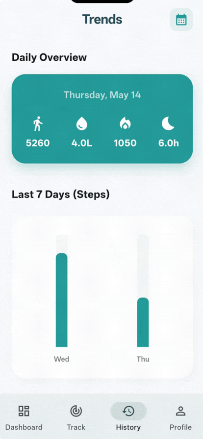
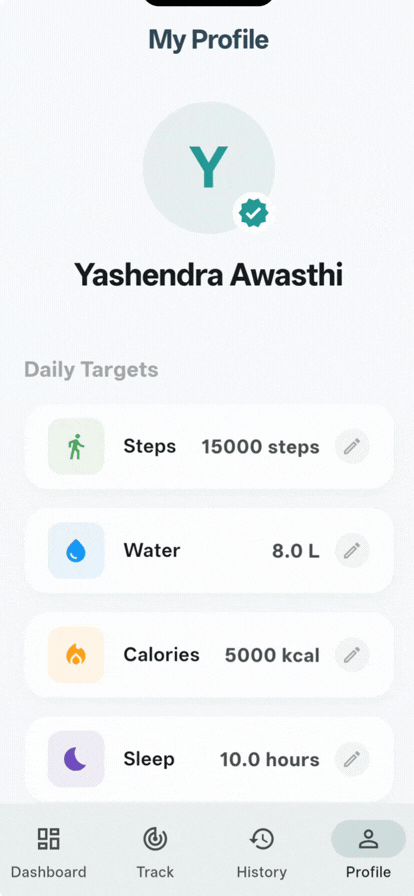
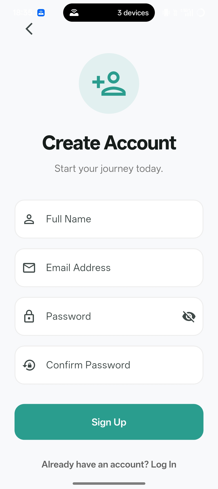
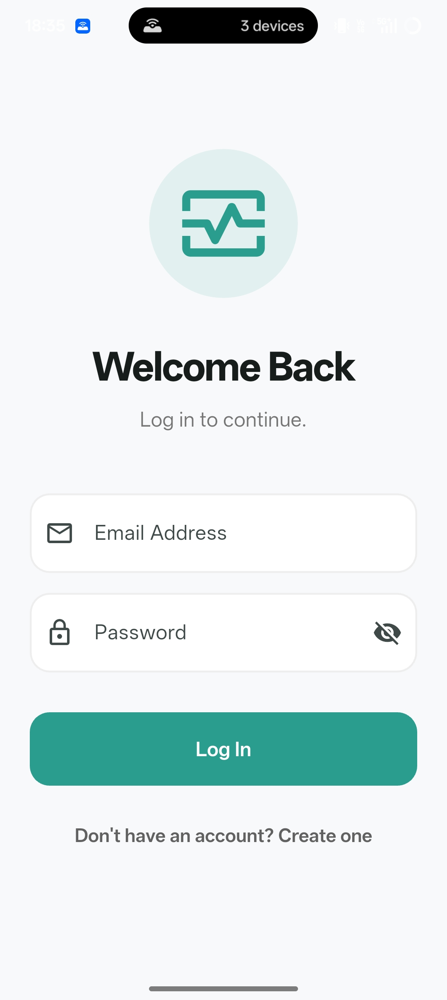

<div align="center">
  

  # Health Tracker 🏃‍♂️
  **A beautifully designed, state-driven Flutter application for daily health monitoring.**

  [](https://flutter.dev)
  [](https://firebase.google.com/)
  [](https://pub.dev/packages/get)
  [](https://m3.material.io/)
</div>

<br/>

## 🎯 About The Project
Health Tracker is a premium mobile application designed to help users log their daily steps, water intake, calories, and sleep. 

I built this project to demonstrate production-ready **Frontend Engineering** practices, focusing on highly responsive UI/UX, seamless state management without `setState` confusions, and optimized data querying.

### ✨ Frontend Highlights
* **Reactive UI:** Built entirely with GetX `Obx()` streams. The UI instantly responds to database changes without manual rebuilds.
* **Modern Design System:** Implemented a custom Material 3 theme with consistent spacing, soft shadows, large border radii, and forgiving input validations.
* **Data Visualization:** Clean, custom-styled bar charts (`fl_chart`) that dynamically scale based on user data.
* **UX Empathy:** Forgiving data parsers, destructive action warnings (Logout), and seamless "Splash-to-Auth" routing.

---

## 📱 App Preview

> **A Note:** Check out these working GIFs!

<p align="center">
   &nbsp;&nbsp;&nbsp;
   &nbsp;&nbsp;&nbsp;
   &nbsp;&nbsp;&nbsp;
  
</p>

<details>
<summary><b>📸 Click to view high-res static screenshots</b></summary>
<br/>
<p align="center">
   
   
</p>
</details>

---

## 🏗 Architecture

### 1. Separation of Concerns (GetX Bindings)
The UI is completely decoupled from business logic. Dependency injection (`Get.lazyPut` and `Get.put`) ensures that controllers are only loaded into memory exactly when the user navigates to their respective screens, keeping the app lightweight.

### 2. Time-Series Data Optimization (Firestore)
Instead of relying on complex Timestamp queries, daily logs are stored using a `yyyy-MM-dd` string format as the Document ID. 
* **Why?** This allows for instantaneous point-reads for the Dashboard, and `O(1)` string-comparison sorting for 7-day history charts, vastly reducing Firestore read costs.

### 3. Safe Type Parsing
Forms utilize custom sanitization (e.g., stripping accidental commas) and `tryParse` cascading logic to prevent silent crashes if users input unexpected decimal values into integer fields.

---

## 🚀 Getting Started

To run this project locally, ensure you have the Flutter SDK installed.

### Prerequisites
* Flutter SDK (`>=3.0.0`)
* Firebase CLI & FlutterFire CLI

### Installation
1. Clone the repo:
   ```bash
   git clone https://github.com/yourusername/health-tracker.git
2. Install Dependencies:
   ```bash
   flutter pub get   
3. Connect Firebase:
   ```bash
   flutterfire configure 
3. Run the app:
   ```bash
   flutter run
   
## 🤝 Let's Connect & Collaborate!
I am always open to connecting with fellow developers and collaborating on exciting projects. If you like what you see here or want to enquire about frontend architecture and UI/UX design, feel free to reach out!

📧 **Email:** yashendraawasthi@gmail.com  
📱 **Phone:** +91 9236311195

[](www.linkedin.com/in/yashendra-awasthi-5800772b8) 
